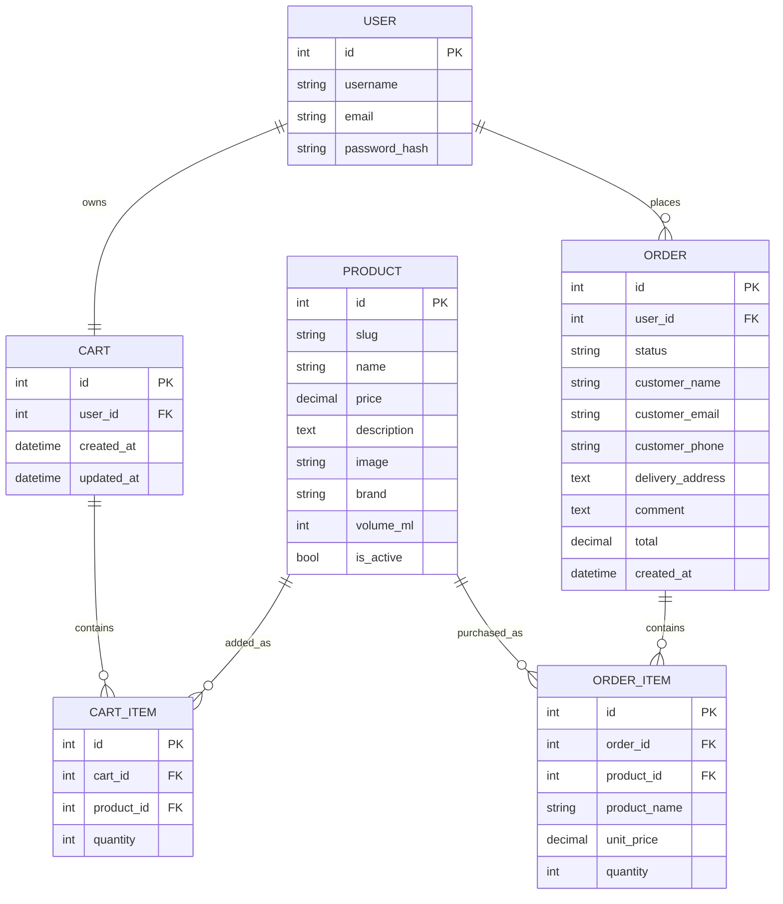

# ER Diagram

```mermaid
erDiagram
    USER ||--|| CART : owns
    CART ||--o{ CART_ITEM : contains
    PRODUCT ||--o{ CART_ITEM : added_as
    USER ||--o{ ORDER : places
    ORDER ||--o{ ORDER_ITEM : contains
    PRODUCT ||--o{ ORDER_ITEM : purchased_as

    USER {
        int id PK
        string username
        string email
        string password_hash
    }

    PRODUCT {
        int id PK
        string slug
        string name
        decimal price
        text description
        string image
        string brand
        int volume_ml
        bool is_active
    }

    CART {
        int id PK
        int user_id FK
        datetime created_at
        datetime updated_at
    }

    CART_ITEM {
        int id PK
        int cart_id FK
        int product_id FK
        int quantity
    }

    ORDER {
        int id PK
        int user_id FK
        string status
        string customer_name
        string customer_email
        string customer_phone
        text delivery_address
        text comment
        decimal total
        datetime created_at
    }

    ORDER_ITEM {
        int id PK
        int order_id FK
        int product_id FK
        string product_name
        decimal unit_price
        int quantity
    }
```
